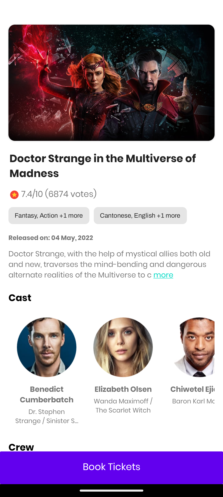
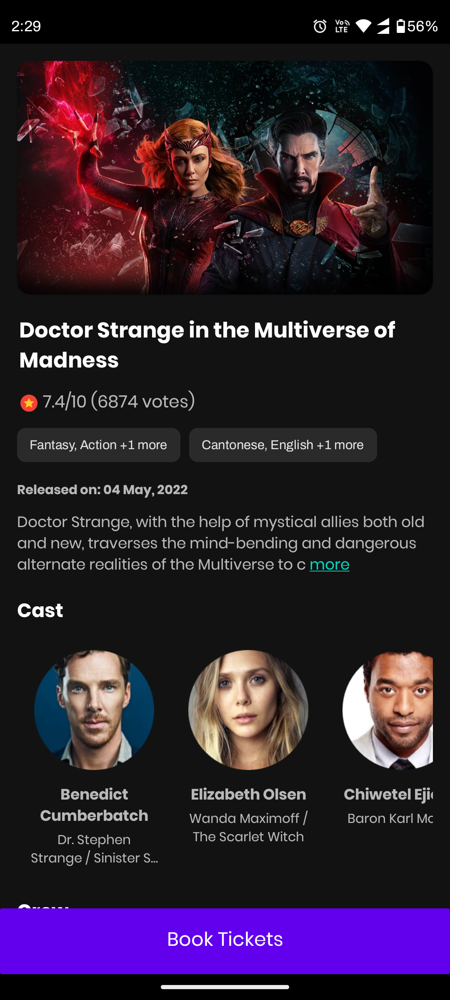
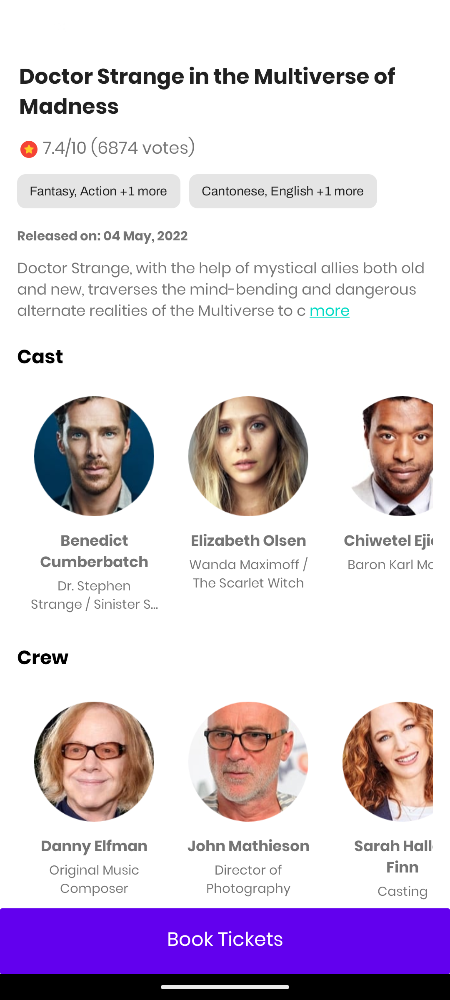
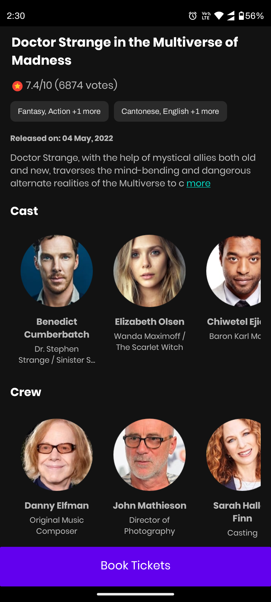

# Movie Multiverse

Movie Ticket Booking App different blog articles from [TMDB](https://www.themoviedb.org/) API.
- Currently shows details of Doctor Strange in the Multiverse of Madness only
- In future list of movies can be added

## Project setup

- Clone this repository and open it in Android Studio.
- Get api key from [tmdb](https://www.themoviedb.org/signup) and add following line to
  local.properties:   
  ```TMDB_API_KEY="<your-tmdb-key-goes-here>"```
- Run the project

## You can download & install latest app ⬇

[](https://github.com/mrwhoknows55/movie-miltiverse/releases/download/1.0/app-release.apk)

### Demo [Video](https://drive.google.com/file/d/1P3z6XyDGpMq0ERMoKtMqlpc1SoBo2qCE/view?usp=share_link)

## Screenshots
<table>
  <tr>
    <td></td>
    <td></td>
  </tr>
  <tr>
      <td></td>
    <td></td>
  </tr>
</table>   


## Technologies and Libraries used:

- Kotlin
- MVVM Architecture
- Coroutines for concurrency
- Hilt for dependency injection
- Coil for image loading
- Retrofit as REST client
- Shimmer for loading animations
- Timber for logging
- Jetpack Navigation Components
- Material Design Components